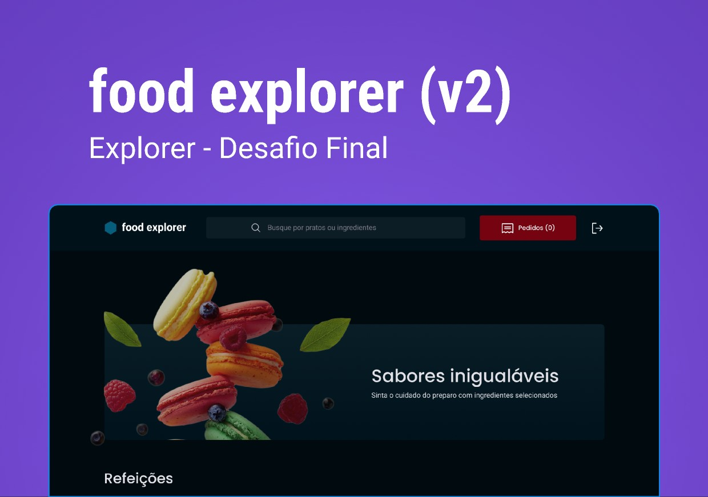

<h1 align="center">
    <a href="#"> Food Explorer </a>
</h1>

<h4 align="center"> 
	 Project Under Eemproving.
</h4>

<p align="center">
 <a href="#-about">About</a> •
 <a href="#-Features">Features</a> •
 <a href="#-layout">Layout</a> • 
 <a href="#-tech-stack">Tech Stack</a> • 
 <a href="#-author">Author</a> • 
 <a href="#-license">License</a>

</p>

---

<p align="center">
  
</p>

## 💻 About

Application under develop for a fictional restaurant, known as Food Explorer.
In this challenge, the following topics were addressed:

- React;
- Routes;
- Components;
- Props;
- Hooks;
- Middlewares
- Consuming its own API from scratch.
- Context
- JWT authentication


## ⚙️ Features

- A structured project, with a good organization of folders, division of components in the front-end, etc.
- A README.md file with specifications on how to run the project in a dev environment.
- Users must authenticate themselves to enter the application through the login screen, you can apply what you learned in JWT authentication classes. Authentication    must be validated with a password.
- The admin will upload images to register the dishes.
- Finally, deploy your application.
- Give your functions and variables meaningful names: work with Clean Code concepts a bit.
- The admin, restaurant and users data will be stored in a database.
- Possibility to search by dish name, ingredients or favorite dish
- It is essential that your interface consumes its own API.
- Interesting to make the application responsive: use the concept of Mobile First that was learned in class.
- It's up to you where to apply animations, transitions, and transformations.
- It meets the model proposed in Figma and contains elements indicative of action and state.

---

## 🎨 Layout 

### Web

[Layout Available on](https://www.figma.com/file/uaEp6tSUKMDIvrAcejTbKS/food-explorer-v2-(Community)?type=design&node-id=201-1532&mode=design&t=2iJZC39nLTlQ4lIw-0)


### Deploy
[Food Explorer](https://foodexplorer-hgdnz.netlify.app/)

---

## 🚀 How it works

This project is divided into two parts:
1. Backend (food-explorer-backend folder) 
2. Frontend (food-explorer-frontend folder)

💡 The Frontend needs the Backend to be running to work.

### Pre-requisites
Before you begin, you will need to have the following tools installed on your machine:
- [Git] (https://git-scm.com)
- [Node.js] (https://nodejs.org/en/)
- In addition, it is good to have an editor to work with the code like [VSCode] (https://code.visualstudio.com/)

#### 🎲 Running the Server (Backend)

```bash
# Clone this repository
$ git clone git@github.com:hgdnz/foodexplorer_frontend.git

# Access the project folder in your terminal
$ cd foodexplorer_backend

# Install the dependencies
$ npm install

# run the migration and seed
$ npm migrate
$ npm seed

# Run the application in development mode
$ npm run dev

# Admin login
$ email: admin@mail.com
$ password: 123456

# User login
$ email: user@mail.com
$ password: 123456

# The Server will start at port: 3333 - go to http://localhost:3333
# Check the terminal status for confirm the port
```
---

#### 🧭 Running the web application (Frontend)

```bash
# Clone this repository
$ git clone git@github.com:hgdnz/foodexplorer_frontend.git
# Access the project folder in your terminal
$ cd foodexplorer_frontend

# Install the dependencies
$ npm install

# Run the application in development mode
$ npm run dev

# The application will open on the port: 5173 - go to http://http://localhost:5173/
# Check the terminal status for confirm the port
```
---

## 🛠 Tech Stack

The following tools were used in the construction of the project:
- [React](https://reactjs.org)
- [HTML](https://developer.mozilla.org/pt-BR/docs/Web/HTML)
- [Styled components](https://styled-components.com/)
- [JavaScript](https://developer.mozilla.org/pt-BR/docs/Web/JavaScript)
- [Sqlite](https://www.sqlite.org/index.html)

---

## 💻  **Project** 

Application under develop for a fictional restaurant, known as Food Explorer.

---
## 🦸 Author

 <br />
 

[](https://www.linkedin.com/in/hugodnz/) 
[](mailto:diniz.hg@gmail.com)


---

## 📝 License

<p align="left">
  
</p>
---

- Made with ❤️ by Hugo Diniz and Rocketseat 
- 👋🏽 [Contact!](https://www.linkedin.com/in/hugodnz/)

---
